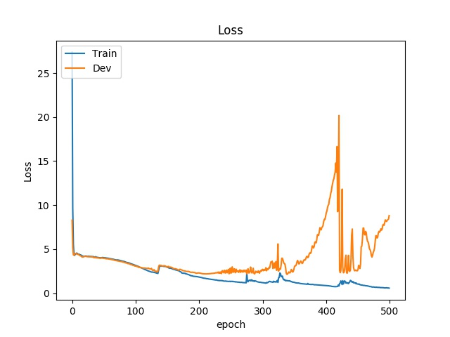

# NTPP : Network Transmission Point Process 


A probabilistic deep machinery that models the traffic characteristics of hosts on a network and effectively forecasts the network traffic patterns, such as load spikes. 


## File Distribution ##

|- `data/`
|- `ntpp /`
	|- `models/`
		|- `data.py` - Declare the Data Class
		|- `model.py`  - Declare the model
		|- `plotter.py` - Function to plot the Loss vs Epoch 
		|- `predicter.py` - Main function to train and validate the data
		|- `scorer.py` - Functions to find the discriminator and generative loss
	|- `utils.py` - Some useful functions 


## How To Use ##

1. **Prepare data** : Use `tshark` or `wireshark` to convert `.pcap` to `.csv`

2. **Download**: 

   ```bash
   git clone https://github.com/vedic-partap/NTPP.git
   cd NTPP
   ```

3. **Install Requirements**: `pip install -r requirements.txt`

4. **Extract Data**:  `python ntpp/test.py`

5. **Train Model**:  `python -m ntpp.models.predicter`


**Output** 




## Parameter ##

| Arguments     | Decription                                           |
| ------------- | ---------------------------------------------------- |
| events        | Event File containing the vents for each host        |
| times         | File containing the time of the events for each host |
| save_dir      | Root dir for saving models                           |
| int_count     | Number of intervals                                  |
| test_size     | Train Test split. e.g. 0.2 means 20% Test 80% Train  |
| time_step     | Time Step                                            |
| batch_size    | Size of the batch                                    |
| element_size  | Element Size                                         |
| h             | Hidden layer Size                                    |
| nl            | Number of RNN Steps                                  |
| seed          | SEED                                                 |
| mode          | What do you want ? train                             |
| epochs        | Number of epochs                                     |
| workers       | Number of workers                                    |
| learning_rate | Learning rate for the optimiser                      |
| metric        | Metric used in discriminator loss                    |
| is_cuda       | use GPU or not                                       |
| optim         | Optimiser                                            |


e.g. `python -m ntpp.models.predicter --epochs 500 --batch_size 11 --optim Adam`


## Version of Python ##

Use Python 3 


## Links of Dataset ##


1. MACCDC :      https://www.netresec.com/?page=MACCDC
2. ISTS: 	        https://www.netresec.com/?page=ISTS 
3. WRCCDC:	https://archive.wrccdc.org/pcaps/
4. ISACDC:  	http://www.westpoint.edu/crc/SitePages/DataSets.aspx
5. WorldCup98: 	http://ita.ee.lbl.gov/html/contrib/WorldCup.html
6. UNIDC:   	http://pages.cs.wisc.edu/~tbenson/IMC10_Data.html
7. snu/bbittorrent: 	https://crawdad.org/~crawdad/snu/bittorrent/20110125/tcpdump/


In case of any doubt or if you want to contribute, contact vedicpartap1999@gmail.com